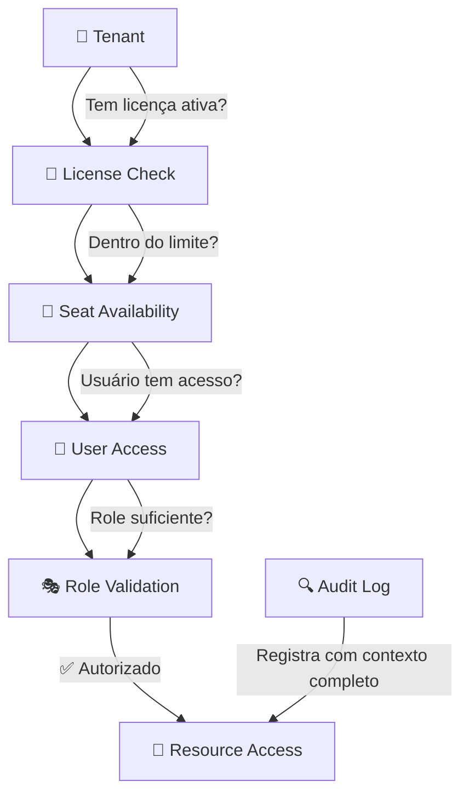
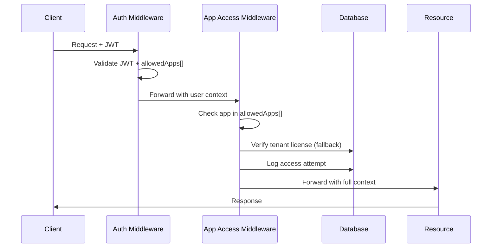

# Simplia PaaS - Multi-Tenant Healthcare Platform

**Uma plataforma PaaS multi-tenant inspirada em ServiceNow/Salesforce com sistema de licenciamento sofisticado para aplicações médicas**

## 📋 Visão Geral

O Simplia PaaS é um monorepo Node.js fullstack que combina:
- **Backend**: Express.js com JavaScript puro para máxima performance
- **Frontend**: React 18 + TypeScript com Vite para desenvolvimento moderno
- **Multi-tenancy**: Isolamento por schema PostgreSQL com switching automático
- **Sistema de Licenciamento**: Arquitetura enterprise de 5 camadas com auditoria completa
- **Compliance**: Campos de auditoria em todas as tabelas + logs detalhados para conformidade médica

## 🏗️ Arquitetura de Pastas e Arquivos

```
simplia-paas/
├── 📁 src/
│   ├── 📁 client/                     # Frontend React + TypeScript
│   │   └── (vazio - preparado para desenvolvimento)
│   │
│   ├── 📁 server/                     # Backend Express.js + JavaScript
│   │   ├── 📁 config/
│   │   │   └── database.js            # Singleton de conexão PostgreSQL com pool
│   │   │
│   │   ├── 📁 middleware/
│   │   │   ├── auth.js                # Autenticação JWT + entitlements
│   │   │   ├── tenant.js              # Resolução e contexto de tenant
│   │   │   └── appAccess.js           # Autorização 5-camadas + auditoria completa
│   │   │
│   │   ├── 📁 models/
│   │   │   ├── User.js                # Gestão de usuários multi-tenant
│   │   │   ├── Tenant.js              # Gestão de tenants com isolamento por schema
│   │   │   ├── TenantUser.js          # Relacionamento tenant-usuário
│   │   │   ├── Application.js         # Catálogo de aplicações/produtos
│   │   │   ├── TenantApplication.js   # Licenças por tenant com controle de assentos
│   │   │   ├── UserApplicationAccess.js # Acesso granular usuário-aplicação
│   │   │   ├── UserType.js            # Tipos de usuário com hierarquia
│   │   │   └── AccessLog.js           # Auditoria detalhada para compliance
│   │   │
│   │   ├── 📁 routes/
│   │   │   ├── auth.js                # Endpoints de autenticação
│   │   │   ├── users.js               # CRUD de usuários
│   │   │   ├── applications.js        # Catálogo de aplicações
│   │   │   └── entitlements.js        # Gestão de licenças e acessos
│   │   │
│   │   ├── 📁 services/
│   │   │   ├── authService.js         # Lógica de autenticação + JWT
│   │   │   └── userService.js         # Lógica de negócio de usuários
│   │   │
│   │   ├── 📁 migrations/
│   │   │   ├── 000_create_users_table.sql                    # Base users table
│   │   │   ├── 001_create_licensing_tables.sql              # Schema de licenciamento
│   │   │   ├── 002_seed_licensing_data.sql                  # Dados iniciais
│   │   │   └── 003_structural_fixes_and_audit_fields_v2.sql # Melhorias enterprise
│   │   │
│   │   ├── 📁 scripts/
│   │   │   └── runMigrations.js       # Executor de migrações SQL
│   │   │
│   │   └── index.js                   # Entry point do servidor Express
│   │
│   └── 📁 shared/
│       └── 📁 types/
│           ├── tenant.js              # Tipos e utilitários de tenant
│           └── user.js                # Tipos e validadores de usuário
│
├── 📁 node_modules/                   # Dependências npm
├── 📁 dist/                          # Build artifacts (gerado)
│
├── 📄 package.json                    # Configuração npm e scripts
├── 📄 tsconfig.json                   # TypeScript para client
├── 📄 tsconfig.server.json           # TypeScript para server build
├── 📄 vite.config.ts                 # Configuração Vite
├── 📄 .env                           # Variáveis de ambiente (não commitado)
├── 📄 .env.example                   # Template de configuração
├── 📄 CLAUDE.md                      # Documentação para Claude Code
└── 📄 README.md                      # Este arquivo
```

## 🎯 Detalhamento de Pastas e Arquivos

### 📁 `src/server/` - Backend Express.js

#### 🔧 `config/`
- **`database.js`**: Singleton de conexão PostgreSQL com pool de conexões, suporte a multi-tenancy via `search_path`, métodos para switching de schema

#### 🛡️ `middleware/`
- **`auth.js`**: Middleware de autenticação JWT com validação de tokens, verificação de status do usuário, injeção de contexto `req.user` com `allowedApps[]`
- **`tenant.js`**: Resolução de tenant via header `x-tenant-id` ou subdomínio, validação e injeção de contexto `req.tenant`  
- **`appAccess.js`**: Autorização enterprise em 5 camadas (License→Seat→User→Role→Audit) com logging detalhado

#### 📊 `models/`
- **`User.js`**: CRUD de usuários com isolamento por tenant, validações, soft delete
- **`TenantUser.js`**: Relacionamento many-to-many entre tenants e usuários
- **`Application.js`**: Catálogo de aplicações/produtos disponíveis na plataforma
- **`Tenant.js`**: Gestão completa de tenants com validação e isolamento de schema
- **`TenantApplication.js`**: Licenças por tenant com controle de vigência, limites de usuários e assentos
- **`UserApplicationAccess.js`**: Acesso granular - quais usuários podem usar quais apps
- **`UserType.js`**: Hierarquia de usuários (secretary < doctor < admin) com permissões
- **`AccessLog.js`**: Logs de auditoria com IP, User-Agent, contexto completo para compliance

#### 🛤️ `routes/`
- **`auth.js`**: Login, registro, refresh token com entitlements
- **`users.js`**: CRUD de usuários com autorização baseada em roles
- **`applications.js`**: Catálogo público e gestão de aplicações (admin)
- **`entitlements.js`**: Gestão de licenças tenant e acesso de usuários

#### ⚙️ `services/`
- **`authService.js`**: Hash de senhas (bcrypt), geração/validação JWT, lógica de entitlements
- **`userService.js`**: Regras de negócio para gestão de usuários

#### 🗃️ `migrations/`
- **`000_create_users_table.sql`**: Tabela base de usuários com tenant isolation
- **`001_create_licensing_tables.sql`**: Schema completo do sistema de licenciamento
- **`002_seed_licensing_data.sql`**: Dados iniciais (user types, aplicações com slugs)
- **`003_structural_fixes_and_audit_fields_v2.sql`**: Tabela tenants + campos de auditoria + 18 índices de performance

#### 🔨 `scripts/`
- **`runMigrations.js`**: Executor de migrações SQL em ordem alfabética

#### 🚀 `index.js`
Entry point do servidor Express com todas as rotas e middlewares configurados

### 📁 `src/client/` - Frontend React + TypeScript
Atualmente vazio, preparado para desenvolvimento futuro da interface

### 📁 `src/shared/` - Código Compartilhado
#### 📝 `types/`
- **`tenant.js`**: Utilitários e validadores para multi-tenancy
- **`user.js`**: Tipos, validadores, factory functions para usuários e JWT

## 🔐 Sistema de Licenciamento Multi-Camadas

### Arquitetura Enterprise de 5 Níveis



### Fluxo de Autorização



### Tabelas do Sistema Enterprise (7 tabelas)

| Tabela | Colunas | Propósito |
|--------|---------|-----------|
| `tenants` | 8 | Registry de tenants com schema mapping e audit fields |
| `users` | 13 | Usuários com tenant isolation e campos de auditoria |
| `user_types` | 9 | Hierarquia de usuários com pricing (secretary < doctor < admin) |
| `applications` | 10 | Catálogo com slugs padronizados (tq, pm, billing, reports) |
| `tenant_applications` | 14 | Licenças por tenant com vigência, limites e controle de assentos |
| `user_application_access` | 12 | Acesso granular (qual usuário pode usar qual app) |
| `application_access_logs` | 13 | Auditoria completa com IP, User-Agent, API path, decision reason |

**Performance**: 18 índices otimizados • 7 relacionamentos FK • Campos de auditoria completos

## 🚀 Comandos Disponíveis

### Desenvolvimento
```bash
# Instalar dependências
npm install

# Executar servidor e cliente em paralelo
npm run dev

# Executar apenas o servidor (porta 3001)
npm run dev:server

# Executar apenas o cliente (porta 3000)  
npm run dev:client
```

### Database
```bash
# Executar migrações
npm run migrate

# Criar database de teste (idempotente)
npm run db:create:test

# Dropar database de teste completamente
npm run db:drop:test
```

### Testes
```bash
# Executar todos os testes (cria database automaticamente)
npm test

# Executar testes em modo watch (desenvolvimento)
npm run test:watch

# Executar testes específicos por padrão
npx jest --testNamePattern="Layer 1"

# Executar arquivo de teste específico
npx jest tests/critical-validation.test.js
```

### Build e Deploy
```bash
# Build completo (client + server)
npm run build

# Build apenas client (output: dist/client)
npm run build:client

# Build apenas server (copia arquivos JS)
npm run build:server

# Iniciar servidor em produção
npm start
```

## ⚙️ Configuração de Ambiente

Copie `.env.example` para `.env` e configure:

```bash
# Database PostgreSQL
DATABASE_HOST=localhost
DATABASE_PORT=5432
DATABASE_NAME=simplia_paas
DATABASE_USER=seu_usuario
DATABASE_PASSWORD=sua_senha

# Database de Testes
TEST_DATABASE_NAME=simplia_paas_test

# JWT
JWT_SECRET=sua-chave-secreta-super-segura
JWT_EXPIRES_IN=24h

# Bcrypt
BCRYPT_SALT_ROUNDS=12

# Multi-tenancy
DEFAULT_TENANT=default
TENANT_HEADER_NAME=x-tenant-id

# Server
PORT=3001
NODE_ENV=development
```

## 📊 Stack Tecnológico

### Backend
- **Node.js** - Runtime JavaScript
- **Express.js** - Framework web minimalista
- **PostgreSQL** - Database relacional com suporte a schemas
- **bcrypt** - Hash seguro de senhas
- **jsonwebtoken** - Autenticação JWT
- **pg** - Driver PostgreSQL
- **dotenv** - Gestão de variáveis de ambiente
- **cors** - Cross-origin resource sharing

### Frontend  
- **React 18** - Biblioteca de interfaces reativas
- **TypeScript** - JavaScript com tipagem estática
- **Vite** - Build tool moderna e rápida

### Desenvolvimento
- **nodemon** - Auto-restart do servidor em desenvolvimento
- **concurrently** - Execução paralela de comandos
- **TypeScript** - Compilação e checagem de tipos

### Testes e Qualidade
- **Jest** - Framework de testes com setup/teardown automático
- **Supertest** - Testes de API e endpoints HTTP
- **Criação automática de DB de teste** - Setup e cleanup transparente

## 🔒 Segurança e Multi-tenancy

### Isolamento de Dados
- **Schema-per-tenant**: Cada tenant tem seu próprio schema PostgreSQL
- **Search Path Switching**: `SET search_path TO tenant_schema, public`
- **Header-based**: Identificação via `x-tenant-id` header

### Autenticação e Autorização
- **JWT Enhanced**: Tokens incluem `allowedApps[]` (slugs) e `userType` para performance
- **5-Layer Authorization**: Tenant License → Seat Check → User Access → Role → Audit
- **Audit Trail**: Log completo com IP, User-Agent, API path, decision reason
- **Password Security**: bcrypt com salt rounds configurável
- **Compliance Ready**: Campos de auditoria em todas as tabelas com triggers automáticos

### Exemplo de Proteção de Rota

```javascript
// Proteger rota por aplicação (usa slug 'tq')
app.get('/api/tq/dashboard', 
  requireAuth,                      // Validar JWT
  requireTranscriptionQuoteAccess(), // 5 camadas: License→Seat→User→Role→Audit
  (req, res) => {
    // req.user - contexto do usuário
    // req.appAccess - info completa (license, seats, accessSource)
    // req.tenant - contexto do tenant
    res.json({ message: 'Autorizado!', context: req.appAccess });
  }
);

// Proteger por role específico no app
app.get('/api/tq/admin',
  requireAuth,
  requireTranscriptionQuoteAccess('admin'), // Role 'admin' + todas as verificações
  adminHandler
);
```

## 🎯 Status Atual: Sistema Enterprise Completo ✅

### ✅ Implementado
- **7 tabelas** com campos de auditoria completos + triggers automáticos para `updated_at`
- **18 índices** otimizados para performance enterprise
- **5 camadas de autorização** (License→Seat→User→Role→Audit) com logging detalhado
- **Multi-tenancy** com isolamento por schema PostgreSQL
- **JWT otimizado** com application slugs (substitui IDs por strings para performance)
- **Compliance médico** com logs contextuais completos (IP, User-Agent, API path, decision reason)
- **Integridade referencial** com 7 relacionamentos FK entre todas as entidades
- **Sistema de testes completo** com Jest + Supertest + criação automática de DB de teste
- **Validação das 4 camadas de autorização** com testes críticos end-to-end
- **Infraestrutura de testes enterprise** com setup/cleanup automático e helpers JWT

### 🚀 Próximos Passos
1. **Frontend Development**: Implementar interface React na pasta `src/client/`
2. **Tenant Management Interface**: Dashboard para gestão de tenants e licenças
3. **API Documentation**: Swagger/OpenAPI para documentar endpoints
4. **Linting & Formatting**: Implementar ESLint, Prettier e pre-commit hooks
5. **Monitoring**: Logging estruturado e métricas de performance
6. **Production Deployment**: Configurar CI/CD e ambientes

## 📄 Licença

Este projeto está sob desenvolvimento para uso interno da Simplia Healthcare Solutions.

---

**Desenvolvido com ❤️ para revolucionar a gestão de aplicações médicas multi-tenant**