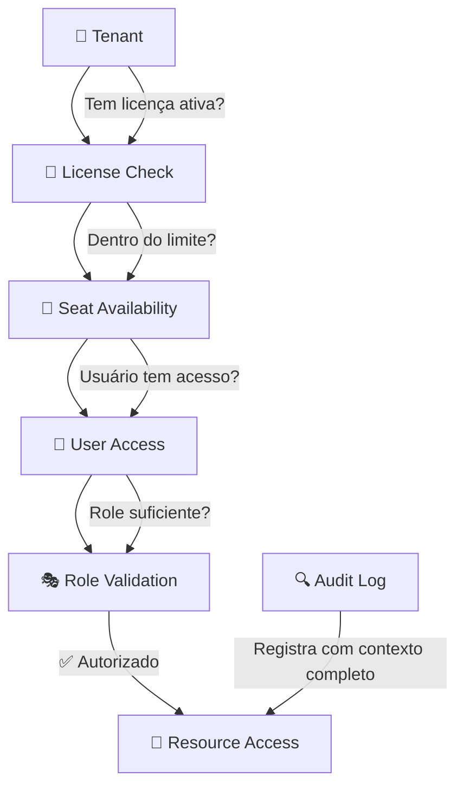
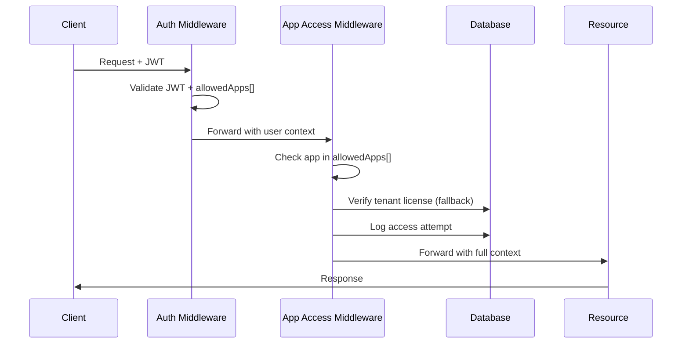

# Simplia PaaS - Multi-Tenant Healthcare Platform

**Uma plataforma PaaS multi-tenant inspirada em ServiceNow/Salesforce com sistema de licenciamento sofisticado para aplicações médicas**

## 📋 Visão Geral

O Simplia PaaS é um monorepo Node.js fullstack que combina:
- **Backend**: Express.js com JavaScript puro para máxima performance
- **Frontend**: React 18 + TypeScript com Vite para desenvolvimento moderno
- **Multi-tenancy**: Isolamento por schema PostgreSQL com switching automático
- **Sistema de Licenciamento**: Arquitetura enterprise de 5 camadas com auditoria completa
- **Compliance**: Campos de auditoria em todas as tabelas + logs detalhados para conformidade médica

## 🏗️ Arquitetura de Pastas e Arquivos

```
simplia-paas/
├── 📁 src/
│   ├── 📁 client/                     # Frontend React + TypeScript
│   │   ├── 📁 apps/                   # Multi-aplicação organizada por domínio
│   │   │   ├── 📁 internal-admin/     # Painel administrativo (internal.simplia.com)
│   │   │   │   ├── 📁 routes/         # Roteamento do painel
│   │   │   │   │   └── index.tsx      # Configuração de rotas
│   │   │   │   ├── 📁 features/       # Funcionalidades admin
│   │   │   │   │   ├── 📁 auth/       # Autenticação
│   │   │   │   │   │   └── Login.tsx  # Página de login com AppError
│   │   │   │   │   ├── 📁 dashboard/  # Dashboard principal
│   │   │   │   │   │   └── Dashboard.tsx # Dashboard com métricas
│   │   │   │   │   └── 📁 tenants/    # Gestão de tenants
│   │   │   │   │       ├── TenantsList.tsx      # Lista de tenants
│   │   │   │   │       ├── CreateTenant.tsx     # Criação com AppFeedback
│   │   │   │   │       ├── types.ts             # TypeScript types para addresses/contacts
│   │   │   │   │       ├── AddressItemForm.tsx  # Form individual de endereço
│   │   │   │   │       ├── ContactItemForm.tsx  # Form individual de contato
│   │   │   │   │       ├── AddressesRepeater.tsx # Repeater para endereços
│   │   │   │   │       └── ContactsRepeater.tsx  # Repeater para contatos
│   │   │   │   ├── 📁 components/     # Componentes específicos do admin
│   │   │   │   │   ├── Header.tsx     # Header do layout
│   │   │   │   │   ├── Sidebar.tsx    # Sidebar de navegação
│   │   │   │   │   └── RouteGuard.tsx # Proteção de rotas
│   │   │   │   ├── 📁 layouts/        # Layouts do painel
│   │   │   │   │   └── AdminLayout.tsx # Layout principal com FeedbackHost
│   │   │   │   ├── 📁 services/       # Cliente para /internal/api/v1
│   │   │   │   │   ├── auth.ts        # Serviço de autenticação
│   │   │   │   │   ├── tenants.ts     # Serviço de tenants
│   │   │   │   │   ├── addresses.ts   # Serviço de endereços
│   │   │   │   │   └── contacts.ts    # Serviço de contatos
│   │   │   │   ├── 📁 store/          # Estado global Zustand
│   │   │   │   │   ├── auth.ts        # Auth store (platformRole)
│   │   │   │   │   ├── ui.ts          # UI store (notifications)
│   │   │   │   │   └── index.ts       # Re-exports
│   │   │   │   ├── 📁 assets/         # Assets específicos do admin
│   │   │   │   └── app.tsx            # Componente principal
│   │   │   ├── 📁 tq-client/          # App do produto TQ (cliente final)
│   │   │   │   ├── 📁 routes/         # rotas específicas do TQ
│   │   │   │   ├── 📁 features/       # funcionalidades do TQ
│   │   │   │   ├── 📁 components/     # componentes do TQ
│   │   │   │   ├── 📁 services/       # cliente para /api/v1/tq
│   │   │   │   └── app.tsx            # componente principal (placeholder)
│   │   │   ├── 📁 crm-client/         # App do produto CRM
│   │   │   │   ├── 📁 routes/ features/ components/ services/
│   │   │   │   └── app.tsx            # (placeholders)
│   │   │   └── 📁 automation-client/  # App do produto Automation
│   │   │       ├── 📁 routes/ features/ components/ services/
│   │   │       └── app.tsx            # (placeholders)
│   │   │
│   │   ├── 📁 common/                 # Reuso visual e utilidades de front
│   │   │   ├── 📁 ui/                 # Design system components (Button, Input, Card, etc.)
│   │   │   │   ├── Button.tsx         # Componente Button com loading states
│   │   │   │   ├── Input.tsx          # Componente Input com validação
│   │   │   │   ├── Card.tsx           # Componente Card refatorado
│   │   │   │   ├── Toast.tsx          # Sistema de toasts
│   │   │   │   ├── Toaster.tsx        # Host de toasts
│   │   │   │   ├── FormSection.tsx    # Seção de formulário com botão add
│   │   │   │   ├── FieldError.tsx     # Display de erro acessível
│   │   │   │   ├── SelectCountry.tsx  # Seletor de país ISO-2
│   │   │   │   └── index.ts           # Re-exports de componentes
│   │   │   │
│   │   │   ├── 📁 feedback/           # Sistema AppFeedback (novo)
│   │   │   │   ├── types.ts           # Interfaces AppFeedback e AppError
│   │   │   │   ├── catalog.ts         # Catálogo de códigos → mensagens
│   │   │   │   ├── store.ts           # Zustand store com telemetria
│   │   │   │   ├── FeedbackHost.tsx   # Componente global de feedback
│   │   │   │   └── index.ts           # Re-exports do domínio
│   │   │   │
│   │   │   ├── 📁 components/         # Componentes de negócio compartilhados
│   │   │   ├── 📁 hooks/              # React hooks compartilhados
│   │   │   │   ├── use-toast.tsx      # Hook de toast
│   │   │   │   └── useRepeater.ts     # Hook genérico para listas (add/remove/primary)
│   │   │   ├── 📁 utils/              # Funções utilitárias
│   │   │   │   └── cn.ts              # Utility para className
│   │   │   └── 📁 constants/          # Constantes e configurações
│   │   │
│   │   ├── 📁 config/
│   │   │   ├── env.ts                 # Configuração de ambiente
│   │   │   └── http.ts                # Cliente HTTP com interceptors AppError + AppFeedback
│   │   │
│   │   ├── 📁 styles/                 # Estilos globais
│   │   │   └── globals.css            # Estilos CSS globais
│   │   │
│   │   ├── index.css                  # Estilos principais com tokens de design
│   │   ├── index.html                 # Template HTML
│   │   └── main.tsx                   # Entry point React
│   │
│   ├── 📁 server/                     # Backend Express.js + JavaScript
│   │   ├── 📁 api/                    # Camada de API organizada por domínio
│   │   │   └── 📁 internal/           # API interna administrativa
│   │   │       └── 📁 routes/         # Routes da API interna
│   │   │           ├── auth.js        # Autenticação e gestão de usuários
│   │   │           ├── users.js       # CRUD de usuários administrativo
│   │   │           ├── applications.js # Catálogo de aplicações
│   │   │           ├── entitlements.js # Gestão de licenças e acessos
│   │   │           ├── audit.js       # Logs de auditoria e compliance
│   │   │           ├── platform-auth.js # Autenticação de plataforma
│   │   │           └── tenants.js     # Gestão de tenants
│   │   │
│   │   ├── 📁 infra/                  # Camada de infraestrutura
│   │   │   ├── 📁 db/
│   │   │   │   └── database.js        # Singleton de conexão PostgreSQL com pool
│   │   │   │
│   │   │   ├── 📁 middleware/
│   │   │   │   ├── auth.js            # Autenticação JWT + entitlements
│   │   │   │   ├── tenant.js          # Resolução e contexto de tenant
│   │   │   │   ├── appAccess.js       # Autorização 5-camadas + auditoria completa
│   │   │   │   └── platformRole.js    # Validação de roles de plataforma
│   │   │   │
│   │   │   ├── 📁 models/
│   │   │   │   ├── User.js            # Gestão de usuários multi-tenant
│   │   │   │   ├── Tenant.js          # Gestão de tenants com isolamento por schema
│   │   │   │   ├── TenantUser.js      # Relacionamento tenant-usuário
│   │   │   │   ├── Application.js     # Catálogo de aplicações/produtos
│   │   │   │   ├── TenantApplication.js # Licenças por tenant com controle de assentos
│   │   │   │   ├── UserApplicationAccess.js # Acesso granular usuário-aplicação
│   │   │   │   ├── UserType.js        # Tipos de usuário com hierarquia
│   │   │   │   └── AccessLog.js       # Auditoria detalhada para compliance
│   │   │   │
│   │   │   ├── 📁 migrations/
│   │   │   │   ├── 001_create_core_tables.sql # Todas tabelas core + relacionamentos + auditoria
│   │   │   │   ├── 002_create_indexes.sql    # Estratégia de indexação organizada
│   │   │   │   ├── 003_seed_initial_data.sql  # Dados essenciais + tenants padrão
│   │   │   │   ├── 004_fix_default_tenant.sql # Correções do tenant padrão
│   │   │   │   ├── 005_fix_admin_password.sql # Correção da senha do admin
│   │   │   │   └── 📁 _backup/         # Migrações antigas (backup)
│   │   │   │
│   │   │   ├── 📁 scripts/
│   │   │   │   ├── runMigrations.js   # Executor de migrações SQL
│   │   │   │   ├── db-create-test.js  # Criação automática de DB teste
│   │   │   │   └── db-drop-test.js    # Limpeza de DB teste
│   │   │   │
│   │   │   ├── authService.js         # Lógica de autenticação + JWT
│   │   │   └── userService.js         # Lógica de negócio de usuários
│   │   │
│   │   ├── 📁 core/                   # Core business logic (reservado)
│   │   │   └── (vazio - para regras de negócio puras)
│   │   │
│   │   ├── app.js                     # Configuração Express (separado para testes)
│   │   └── index.js                   # Entry point do servidor Express
│   │
│   └── 📁 shared/
│       └── 📁 types/
│           ├── tenant.js              # Tipos e utilitários de tenant
│           └── user.js                # Tipos e validadores de usuário
│
├── 📁 tests/                         # Suíte de testes organizada
│   ├── 📁 integration/               # Testes de integração
│   │   ├── 📁 internal/              # Testes da API interna administrativa
│   │   │   ├── critical-validation.test.js  # Validação das 5 camadas de autorização
│   │   │   └── internal-api-validation.test.js # Testes de endpoints da API interna
│   │   ├── 📁 tq/                    # Testes de Transcription Quote (placeholder)
│   │   ├── 📁 crm/                   # Testes de CRM (placeholder)
│   │   └── 📁 automation/            # Testes de Automation (placeholder)
│   ├── 📁 unit/                      # Testes unitários
│   │   └── 📁 core/                  # Testes de lógica de negócio pura
│   ├── auth-helper.js                # Utilitários para geração de tokens JWT
│   └── setup.js                      # Setup global dos testes
│
├── 📁 node_modules/                   # Dependências npm
├── 📁 dist/                          # Build artifacts (gerado)
│
├── 📄 package.json                   # Dependências e scripts npm
├── 📄 tsconfig.json                  # Configuração TypeScript global
├── 📄 tsconfig.server.json           # Configuração TypeScript para servidor
├── 📄 vite.config.ts                 # Configuração Vite
├── 📄 tailwind.config.js             # Configuração Tailwind CSS
├── 📄 postcss.config.js              # Configuração PostCSS
├── 📄 jest.config.js                 # Configuração Jest para testes
├── 📄 .env                           # Variáveis de ambiente (não commitado)
├── 📄 .env.example                   # Template de configuração
├── 📄 index.html                     # Template HTML raiz
├── 📄 CLAUDE.md                      # Documentação para Claude Code
├── 📄 TESTING-QA.md                  # Documentação de testes e QA
└── 📄 README.md                      # Este arquivo
```

## 🎯 Detalhamento de Pastas e Arquivos

### 📁 `src/server/` - Backend Express.js

#### 🌐 `api/` - Camada de API
- **`internal/routes/`**: API administrativa interna
  - **`auth.js`**: Login, registro, gestão de sessões
  - **`users.js`**: CRUD administrativo de usuários com bulk operations
  - **`applications.js`**: Catálogo de aplicações e gestão
  - **`entitlements.js`**: Gestão de licenças tenant e acesso de usuários
  - **`audit.js`**: Logs de auditoria e relatórios de compliance
  - **`platform-auth.js`**: Autenticação de plataforma
  - **`tenants.js`**: Gestão administrativa de tenants

#### 🏗️ `infra/` - Camada de Infraestrutura
- **`db/database.js`**: Singleton de conexão PostgreSQL com pool, suporte a multi-tenancy via `search_path`
- **`middleware/`**: Processamento de requisições
  - **`auth.js`**: Middleware de autenticação JWT com validação de tokens, verificação de status, injeção de contexto `req.user` com `allowedApps[]`
  - **`tenant.js`**: Resolução de tenant via header `x-tenant-id` ou subdomínio, validação e injeção de contexto `req.tenant`  
  - **`appAccess.js`**: Autorização enterprise em 5 camadas (License→Seat→User→Role→Audit) com logging detalhado
  - **`platformRole.js`**: Validação de roles de plataforma para APIs internas
- **`models/`**: Abstrações de banco com CRUD tenant-aware
  - **`User.js`**: CRUD de usuários com isolamento por tenant, validações, soft delete
  - **`TenantUser.js`**: Relacionamento many-to-many entre tenants e usuários
  - **`Application.js`**: Catálogo de aplicações/produtos disponíveis na plataforma
  - **`Tenant.js`**: Gestão completa de tenants com validação e isolamento de schema
  - **`TenantApplication.js`**: Licenças por tenant com controle de vigência, limites de usuários e assentos
  - **`UserApplicationAccess.js`**: Acesso granular - quais usuários podem usar quais apps
  - **`UserType.js`**: Hierarquia de usuários (operations < manager < admin) com permissões
  - **`AccessLog.js`**: Logs de auditoria com IP, User-Agent, contexto completo para compliance
- **`migrations/`**: Evolução do schema de banco
  - **`001_create_core_tables.sql`**: Todas as tabelas core com relacionamentos, campos de auditoria e triggers automáticos
  - **`002_create_indexes.sql`**: Estratégia completa de indexação organizada por propósito (lookup, performance, audit)
  - **`003_seed_initial_data.sql`**: Dados essenciais (user types: operations/manager/admin, applications, tenants padrão)
  - **`_backup/`**: Migrações antigas preservadas
- **`scripts/`**: Utilitários de banco
  - **`runMigrations.js`**: Executor de migrações SQL em ordem alfabética
  - **`db-create-test.js`**: Criação automática de database de teste
  - **`db-drop-test.js`**: Limpeza completa de database de teste
- **`authService.js`**: Hash de senhas (bcrypt), geração/validação JWT, lógica de entitlements
- **`userService.js`**: Regras de negócio para gestão de usuários

#### 🎯 `core/` - Lógica de Negócio (Futuro)
Reservado para regras de negócio puras sem dependências de HTTP/Database

#### 🚀 Arquivos Raiz
- **`app.js`**: Configuração Express (separado para testes)
- **`index.js`**: Entry point do servidor Express

### 📁 `src/client/` - Frontend React + TypeScript

#### 🌐 `apps/` - Arquitetura Multi-Aplicação
- **`internal-admin/`**: Painel administrativo para internal.simplia.com
  - **`routes/`**: Rotas específicas (dashboard, tenants, users, applications, entitlements, audit)
  - **`features/`**: Funcionalidades de negócio (licensing, user management, etc.)
  - **`components/`**: Componentes específicos do painel administrativo
  - **`layouts/`**: Layouts e estruturas de página do admin
  - **`services/`**: Cliente HTTP para `/internal/api/v1`
  - **`store/`**: Estado global (autenticação platformRole, tenant selecionado)
  - **`assets/`**: Assets específicos do painel
  - **`app.tsx`**: Componente principal (placeholder)

- **`tq-client/`**: Aplicação do produto Transcription Quote
  - **`routes/`**: Rotas específicas do produto TQ
  - **`features/`**: Funcionalidades específicas do TQ
  - **`components/`**: Componentes específicos do TQ
  - **`services/`**: Cliente HTTP para `/api/v1/tq`
  - **`app.tsx`**: Componente principal (placeholder)

- **`crm-client/`** e **`automation-client/`**: Estrutura similar para produtos CRM e Automation (placeholders)

#### 🔗 `common/` - Componentes e Utilitários Compartilhados
- **`ui/`**: Design system e componentes visuais base
- **`components/`**: Componentes de negócio reutilizáveis entre apps
- **`hooks/`**: React hooks compartilhados
- **`utils/`**: Funções utilitárias e helpers
- **`constants/`**: Constantes e configurações globais

#### ⚙️ `config/` - Configuração Global
- **`env.ts`**: Gerenciamento de variáveis de ambiente (placeholder)
- **`http.ts`**: Configuração de clientes HTTP e interceptors (placeholder)

#### 🚀 `main.tsx`
Entry point principal da aplicação React com roteamento global (placeholder)

### 📁 `src/shared/` - Código Compartilhado
#### 📝 `types/`
- **`tenant.js`**: Utilitários e validadores para multi-tenancy
- **`user.js`**: Tipos, validadores, factory functions para usuários e JWT

## 🔐 Sistema de Licenciamento Multi-Camadas

### Arquitetura Enterprise de 5 Níveis



### Fluxo de Autorização



### Tabelas do Sistema Enterprise (7 tabelas)

| Tabela | Colunas | Propósito |
|--------|---------|-----------|
| `tenants` | 8 | Registry de tenants com schema mapping e audit fields |
| `users` | 13 | Usuários com tenant isolation e campos de auditoria |
| `user_types` | 9 | Hierarquia de usuários com pricing (operations < manager < admin) |
| `applications` | 10 | Catálogo com slugs padronizados (tq, pm, billing, reports) |
| `tenant_applications` | 14 | Licenças por tenant com vigência, limites e controle de assentos |
| `user_application_access` | 12 | Acesso granular (qual usuário pode usar qual app) |
| `application_access_logs` | 13 | Auditoria completa com IP, User-Agent, API path, decision reason |

**Performance**: 18 índices otimizados • 7 relacionamentos FK • Campos de auditoria completos

## 🚀 Comandos Disponíveis

### Desenvolvimento
```bash
# Instalar dependências
npm install

# Executar servidor e cliente em paralelo
npm run dev

# Executar apenas o servidor (porta 3001)
npm run dev:server

# Executar apenas o cliente (porta 3000)  
npm run dev:client
```

### Database
```bash
# Executar migrações
npm run migrate

# Criar database de teste (idempotente)
npm run db:create:test

# Dropar database de teste completamente
npm run db:drop:test
```

### Testes
```bash
# Executar todos os testes (cria database automaticamente)
npm test

# Executar testes em modo watch (desenvolvimento)
npm run test:watch

# Executar testes específicos por padrão
npx jest --testNamePattern="Layer 1"

# Executar arquivo de teste específico
npx jest tests/integration/internal/critical-validation.test.js

# Executar apenas testes de API interna
npx jest tests/integration/internal/

# Executar testes de um produto específico (futuro)
npx jest tests/integration/tq/
```

### Build e Deploy
```bash
# Build completo (client + server)
npm run build

# Build apenas client (output: dist/client)
npm run build:client

# Build apenas server (copia arquivos JS)
npm run build:server

# Iniciar servidor em produção
npm start
```

### API e Documentação
```bash
# Iniciar servidor para acesso à documentação Swagger
npm run dev:server

# Acessar documentação da API interna (requer autenticação admin)
# http://localhost:3001/docs/internal
```

## ⚙️ Configuração de Ambiente

Copie `.env.example` para `.env` e configure:

```bash
# Database PostgreSQL
DATABASE_HOST=localhost
DATABASE_PORT=5432
DATABASE_NAME=simplia_paas
DATABASE_USER=seu_usuario
DATABASE_PASSWORD=sua_senha

# Database de Testes
TEST_DATABASE_NAME=simplia_paas_test

# JWT
JWT_SECRET=sua-chave-secreta-super-segura
JWT_EXPIRES_IN=24h

# Bcrypt
BCRYPT_SALT_ROUNDS=12

# Multi-tenancy
DEFAULT_TENANT=default
TENANT_HEADER_NAME=x-tenant-id

# Server
PORT=3001
NODE_ENV=development

# API Configuration (Versioned Internal API)
INTERNAL_API_PREFIX=/internal/api/v1
ENABLE_INTERNAL_DOCS=true
INTERNAL_DOCS_PATH=/docs/internal
ADMIN_PANEL_ORIGIN=http://localhost:5173

# Security
ENABLE_HELMET=true

# Frontend Environment Variables (Vite)
VITE_INTERNAL_API_BASE_URL=/internal/api/v1
VITE_TQ_API_BASE_URL=/api/v1/tq
VITE_CRM_API_BASE_URL=/api/v1/crm
VITE_AUT_API_BASE_URL=/api/v1/automation
```

## 📊 Stack Tecnológico

### Backend
- **Node.js** - Runtime JavaScript
- **Express.js** - Framework web minimalista
- **PostgreSQL** - Database relacional com suporte a schemas
- **bcrypt** - Hash seguro de senhas
- **jsonwebtoken** - Autenticação JWT
- **pg** - Driver PostgreSQL
- **dotenv** - Gestão de variáveis de ambiente
- **cors** - Cross-origin resource sharing  
- **swagger-ui-express** - Documentação interativa da API
- **swagger-jsdoc** - Geração de documentação OpenAPI
- **helmet** - Security headers middleware

### Frontend  
- **React 18** - Biblioteca de interfaces reativas
- **TypeScript** - JavaScript com tipagem estática
- **Vite** - Build tool moderna e rápida
- **Tailwind CSS** v3.4.17 - Framework CSS utilitário com design system customizado
- **Framer Motion** - Animações e transições fluidas
- **Lucide React** - Ícones SVG otimizados
- **Zustand** - Gerenciamento de estado global
- **React Router DOM** - Roteamento declarativo

### Design System e UX
- **Design Tokens** - Sistema de cores global com CSS custom properties
- **Componentes A11y** - Interface acessível com ARIA compliant
- **Error Handling** - Sistema de erros amigáveis com telemetria
- **Responsive Design** - Layouts multi-coluna adaptativos

### Desenvolvimento
- **nodemon** - Auto-restart do servidor em desenvolvimento
- **concurrently** - Execução paralela de comandos
- **TypeScript** - Compilação e checagem de tipos

### Testes e Qualidade
- **Jest** - Framework de testes com setup/teardown automático
- **Supertest** - Testes de API e endpoints HTTP
- **Criação automática de DB de teste** - Setup e cleanup transparente

## 🔒 Segurança e Multi-tenancy

### Isolamento de Dados
- **Schema-per-tenant**: Cada tenant tem seu próprio schema PostgreSQL
- **Search Path Switching**: `SET search_path TO tenant_schema, public`
- **Header-based**: Identificação via `x-tenant-id` header

### Autenticação e Autorização
- **JWT Enhanced**: Tokens incluem `allowedApps[]` (slugs) e `userType` para performance
- **5-Layer Authorization**: Tenant License → Seat Check → User Access → Role → Audit
- **Audit Trail**: Log completo com IP, User-Agent, API path, decision reason
- **Password Security**: bcrypt com salt rounds configurável
- **Compliance Ready**: Campos de auditoria em todas as tabelas com triggers automáticos

### Exemplo de Proteção de Rota

```javascript
// Proteger rota por aplicação (usa slug 'tq') - API versionada
app.get('/internal/api/v1/tq/dashboard', 
  requireAuth,                      // Validar JWT
  requireTranscriptionQuoteAccess(), // 5 camadas: License→Seat→User→Role→Audit
  (req, res) => {
    // req.user - contexto do usuário
    // req.appAccess - info completa (license, seats, accessSource)
    // req.tenant - contexto do tenant
    res.json({ message: 'Autorizado!', context: req.appAccess });
  }
);

// Proteger por role específico no app
app.get('/internal/api/v1/tq/admin',
  requireAuth,
  requireTranscriptionQuoteAccess('admin'), // Role 'admin' + todas as verificações
  adminHandler
);
```

## 🎯 Status Atual: Sistema Enterprise Completo ✅

### ✅ **Internal Admin API - 100% Implementada**
A **API Interna** para o painel `internal.simplia.com` está **completa e operacional**:

#### **Applications (Escopo Plataforma)**
- ✅ **Listagem** com filtros e paginação (`GET /applications`)
- ✅ **Consulta** por ID (`GET /applications/:id`) e slug (`GET /applications/slug/:slug`)
- ✅ **CRUD completo** (POST, PUT, DELETE com soft-delete)
- ✅ **Tenants licenciados** (`GET /applications/:id/tenants`)
- ✅ **Proteção** com `platform_role: internal_admin`
- ✅ **Swagger** com documentação completa e exemplos

#### **Users (Escopo Tenant)**
- ✅ **CRUD completo** com validação de permissões e filtros
- ✅ **Grant/Revoke** de acesso a aplicações (`POST /users/:id/apps/grant`, `DELETE /users/:id/apps/revoke`)
- ✅ **Bulk operations** e reset de senha
- ✅ **Header** `x-tenant-id` obrigatório
- ✅ **Swagger** com documentação completa e exemplos

#### **Entitlements (Escopo Tenant)**  
- ✅ **Listar licenças** do tenant (`GET /entitlements`)
- ✅ **Ativar licença** (`POST /entitlements/:slug/activate`)
- ✅ **Ajustar licença** (`PUT /entitlements/:slug/adjust`) - controle de limites/status/vigência
- ✅ **Gestão de assentos** automática com tracking
- ✅ **Header** `x-tenant-id` obrigatório
- ✅ **Swagger** com documentação completa e exemplos

#### **Infraestrutura Enterprise**
- ✅ **Prefixo versionado** `/internal/api/v1` com roteamento organizado
- ✅ **CORS restrito** ao domínio do admin panel para segurança
- ✅ **Documentação Swagger** protegida (`/docs/internal`) - apenas `internal_admin`
- ✅ **Platform roles** para controle da equipe Simplia vs. roles de tenant
- ✅ **Padronização de erros** consistente com códigos e mensagens
- ✅ **Testes de integração** completos incluindo cenários de erro
- ✅ **Auditoria automática** em negações de acesso

### ✅ **Frontend Enterprise UI - Implementado**
O **painel administrativo interno** possui interface moderna e profissional:

#### **Sistema de Design Consistente**
- ✅ **Design Tokens** globais com CSS custom properties (`--brand-primary`, `--brand-secondary`)
- ✅ **Componentes A11y** com ARIA attributes e acessibilidade completa
- ✅ **Tailwind v3.4.17** integrado com sistema customizado de componentes
- ✅ **Responsividade** com layouts adaptativos e multi-coluna

#### **Tratamento de Erros Amigável**
- ✅ **AppError System** - Erros HTTP normalizados em mensagens amigáveis
- ✅ **Catálogo de Mensagens** em inglês com mapeamento contextual
- ✅ **Telemetria de Desenvolvimento** com logging detalhado
- ✅ **UX Otimizada** - Banners para erros globais, inline para validação de campos
- ✅ **Exemplos**: "Incorrect email or password" vs "HTTP 401" bruto

#### **AppFeedback System (Sucesso + Erros Padronizados)**
- ✅ **Backend Meta Envelope** - Respostas 2xx com `{meta: {code, message}, data}` 
- ✅ **Interceptor HTTP Automático** - Detecta `meta.code` e publica feedback sem código manual
- ✅ **Domínio Centralizado** - `common/feedback/` com types, catalog, store, host
- ✅ **Feedback Visual Acessível** - Toasts (`aria-live="polite"`) + Banners (`role="alert"`)
- ✅ **Catálogo Extensível** - Mapeamento códigos → mensagens (TENANT_CREATED, LOGIN_SUCCESS, etc.)
- ✅ **Auto-dismiss Inteligente** - Sucessos somem automaticamente, erros persistem
- ✅ **Deduplicação Avançada** - Janela de 5s evita toasts duplicados durante navegação
- ✅ **Telemetria Integrada** - `feedback_shown {kind, code, path}` para analytics
- ✅ **Login Migrado** - Sistema unificado com banner inline (erros) + toast global (sucesso)
- ✅ **Sistema Limpo** - Removido sistema antigo `services/errors/`, tudo centralizado em `common/feedback/`
- ✅ **Comportamento Híbrido** - Erros inline no formulário, sucessos como toast global

#### **Formulários Inteligentes**
- ✅ **Layout Multi-coluna** responsivo com seções organizadas
- ✅ **Validação Híbrida** - Cliente + servidor com feedback em tempo real  
- ✅ **Campos Auto-gerados** - Schema names automáticos baseados em display names
- ✅ **Componentes Repeater** - Sistema dinâmico de add/remove com constraints de negócio

#### **Gestão de Endereços & Contatos**
- ✅ **9 Tabelas** - tenant_addresses e tenant_contacts integrados ao sistema principal
- ✅ **8 Endpoints API** - CRUD completo com autenticação platform_role
- ✅ **7 Componentes Frontend** - useRepeater hook + UI components modulares
- ✅ **Tipos Estruturados** - HQ/BILLING/SHIPPING (endereços) + ADMIN/BILLING/TECH/LEGAL (contatos)
- ✅ **Primary Constraints** - Uma primary por tipo por tenant com enforcement automático  
- ✅ **Validação E.164** - Phone numbers em formato internacional padrão
- ✅ **ISO-2 Countries** - Códigos de país com selector pré-populado
- ✅ **AppFeedback Integration** - Success/error messaging automático
- ✅ **A11y Compliance** - ARIA completo + navegação por teclado
- ✅ **Analytics Tracking** - Telemetria em todas interações do usuário

#### **Componentes de Navegação**
- ✅ **Sidebar Colapsável** com ícones otimizados e hover states
- ✅ **Breadcrumbs Funcionais** com navegação e indicadores visuais
- ✅ **Headers Alinhados** com altura consistente e shadow apropriada
- ✅ **Animation System** com Framer Motion para transições fluidas

### ✅ **Fundação Enterprise Implementada**
- **9 tabelas** com campos de auditoria completos + triggers automáticos para `updated_at`
- **20+ índices** otimizados para performance enterprise incluindo partial unique constraints
- **5 camadas de autorização** (License→Seat→User→Role→Audit) com logging detalhado
- **Multi-tenancy** com isolamento por schema PostgreSQL
- **JWT otimizado** com application slugs (substitui IDs por strings para performance)
- **Gestão completa** de endereços e contatos com constraints de negócio
- **JWT role override** - Middleware permite overriding de role via JWT para testes e flexibilidade
- **Compliance médico** com logs contextuais completos (IP, User-Agent, API path, decision reason)
- **Integridade referencial** com 7 relacionamentos FK entre todas as entidades
- **Sistema de testes completo** com Jest + Supertest + criação automática de DB de teste
- **Validação das 5 camadas de autorização** com testes críticos end-to-end (todas as 10 validações passando ✅)
- **Infraestrutura de testes enterprise** com setup/cleanup automático e helpers JWT
- **Error Handling Profissional** com mensagens amigáveis e acessibilidade completa

### 🚀 Próximos Passos
1. **Expansão do Internal Admin Panel**: Completar páginas de users, applications e entitlements
2. **Tenant Management Enhancement**: Edição, visualização e histórico de addresses/contacts
3. **Product Applications**: Desenvolver interfaces para TQ, CRM e Automation clients  
4. **Public API Development**: Criar APIs públicas dos produtos (separadas da API interna)
5. **Advanced UI Components**: Tabelas avançadas, modais, dropdowns e filtros
6. **Dashboard Analytics**: Métricas em tempo real e relatórios visuais
7. **Linting & Formatting**: Implementar ESLint, Prettier e pre-commit hooks
8. **Monitoring**: Logging estruturado e métricas de performance
9. **Production Deployment**: Configurar CI/CD e ambientes

### ✨ Implementações Recentes (Janeiro 2025)
- **✅ Gestão Completa de Endereços & Contatos**: Sistema enterprise com 9 tabelas, 8 APIs e 7 componentes frontend
- **✅ Componentes Repeater**: useRepeater hook genérico + UI components modulares 
- **✅ Validação Avançada**: Primary constraints, E.164 phone, ISO-2 countries
- **✅ AppFeedback Integration**: Success/error messaging automático
- **✅ A11y Compliance**: ARIA completo + navegação por teclado

#### Uso dos Novos Componentes
```typescript
// useRepeater - Hook genérico para listas com add/remove/primary
const { items, add, remove, update, setPrimary } = useRepeater<AddressFormValues>({
  initialItems: addresses,
  primaryKey: 'is_primary',
  typeKey: 'type'
});

// Componentes Repeater - Já integrados no CreateTenant
<AddressesRepeater addresses={addresses} onChange={setAddresses} errors={errors} />
<ContactsRepeater contacts={contacts} onChange={setContacts} errors={errors} />
```

### 📈 Status de Desenvolvimento
- 🟢 **Backend API**: 100% completo com documentação Swagger + addresses/contacts APIs
- 🟢 **Frontend Foundation**: Design system e error handling implementados  
- 🟢 **Tenant Management**: Criação completa com addresses/contacts + repeater components
- 🟡 **Admin Interface**: Dashboard, tenants prontos - users/applications/entitlements pendentes
- 🔴 **Product Apps**: Estrutura criada - desenvolvimento pendente
- 🔴 **Public APIs**: Aguardando definição de requisitos dos produtos

## 📄 Licença

Este projeto está sob desenvolvimento para uso interno da Simplia Healthcare Solutions.

---

**Desenvolvido com ❤️ para revolucionar a gestão de aplicações médicas multi-tenant**