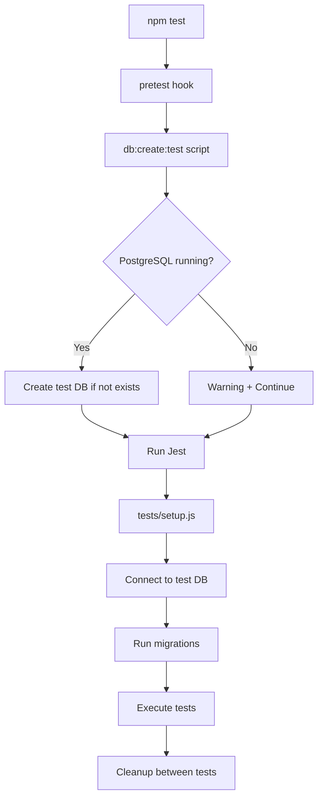

# TESTING-QA.md

## 🧪 Sistema de Testes e Garantia de Qualidade - Simplia PaaS

Documentação completa da infraestrutura de testes enterprise implementada para validação das 5 camadas de autorização multi-tenant.

---

## 📋 Visão Geral

O Simplia PaaS implementa um **sistema de testes robusto e automático** focado na validação crítica das camadas de segurança e autorização enterprise. O sistema foi projetado para:

- ✅ **Validar as 5 camadas de autorização** (License → Seat → User → Role → Audit)
- ✅ **Testar cenários críticos** de segurança multi-tenant
- ✅ **Garantir integridade** do sistema de licenciamento
- ✅ **Automatizar setup/cleanup** de database de teste
- ✅ **Fornecer feedback rápido** para desenvolvimento
- ✅ **JWT role override** para testes flexíveis sem modificação de dados

---

## 🏗️ Arquitetura de Testes

### Estrutura de Pastas

```
simplia-paas/
├── 📁 tests/
│   ├── setup.js                    # Configuração global Jest + DB
│   ├── auth-helper.js               # Utilitários JWT para testes
│   └── critical-validation.test.js  # Testes das 5 camadas de autorização
├── 📁 src/server/scripts/
│   ├── db-create-test.js           # Criação automática do DB de teste
│   └── db-drop-test.js             # Reset completo do DB de teste
├── jest.config.js                  # Configuração Jest
└── package.json                    # Scripts de teste
```

---

## 🔧 Configuração e Setup

### 1. Dependências de Teste

```json
{
  "devDependencies": {
    "jest": "^30.1.1",      // Framework de testes principal
    "supertest": "^7.1.4"   // Testes de API HTTP
  }
}
```

### 2. Configuração Jest (`jest.config.js`)

```javascript
module.exports = {
  testEnvironment: 'node',                    // Ambiente Node.js
  roots: ['<rootDir>/tests'],                 // Pasta de testes
  testMatch: ['**/tests/**/*.test.js'],       // Padrão de arquivos
  setupFilesAfterEnv: ['<rootDir>/tests/setup.js'], // Setup global
  testTimeout: 15000,                         // Timeout de 15s por teste
};
```

### 3. Variáveis de Ambiente

Configurar no `.env`:
```bash
# Database de Testes (separado do desenvolvimento)
TEST_DATABASE_NAME=simplia_paas_test

# Configurações existentes (reutilizadas para testes)
DATABASE_HOST=localhost
DATABASE_PORT=5432
DATABASE_USER=seu_usuario
DATABASE_PASSWORD=sua_senha
JWT_SECRET=dev-secret-key-not-for-production
```

---

## 🚀 Scripts NPM e Comandos

### Scripts Principais

```json
{
  "scripts": {
    "db:create:test": "node src/server/scripts/db-create-test.js",
    "db:drop:test": "node src/server/scripts/db-drop-test.js", 
    "pretest": "npm run db:create:test",
    "test": "jest",
    "test:watch": "jest --watch"
  }
}
```

### Comandos de Uso

```bash
# 🎯 Executar todos os testes (fluxo completo automático)
npm test

# 🔄 Modo watch para desenvolvimento 
npm run test:watch

# 🎯 Executar testes específicos por padrão
npx jest --testNamePattern="Layer 1"
npx jest --testNamePattern="Tenant License"

# 📁 Executar arquivo específico
npx jest tests/critical-validation.test.js

# 🗃️ Gestão manual do database de teste
npm run db:create:test  # Criar DB (idempotente)
npm run db:drop:test    # Reset completo
```

---

## 🗃️ Sistema de Database de Teste

### Fluxo Automático



### 1. Script de Criação (`db-create-test.js`)

**Localização**: `src/server/scripts/db-create-test.js`

**Funcionalidades**:
- ✅ **Criação idempotente** - pode ser executado múltiplas vezes
- ✅ **Conexão segura** - usa database administrativo `postgres`
- ✅ **Encoding UTF-8** - configuração adequada para dados médicos
- ✅ **Ownership automático** - define owner como usuário configurado
- ✅ **Tratamento de erros** - avisa se PostgreSQL indisponível mas continua
- ✅ **Cross-platform** - funciona em Windows, Mac e Linux

**Exemplo de execução**:
```bash
$ npm run db:create:test

> simplia-paas@1.0.0 db:create:test
> node src/server/scripts/db-create-test.js

[db:create:test] Creating database 'simplia_paas_test'...
[db:create:test] Database 'simplia_paas_test' created successfully
```

**Em caso de PostgreSQL indisponível**:
```bash
[db:create:test] ⚠️  PostgreSQL is not running or inaccessible
[db:create:test] For local development, make sure:
[db:create:test] 1. PostgreSQL is installed and running
[db:create:test] 2. Credentials in .env are correct
[db:create:test] 3. User has permission to create databases
[db:create:test] Continuing anyway (tests may fail)...
```

### 2. Script de Reset (`db-drop-test.js`)

**Funcionalidades**:
- 🗑️ **Drop completo** - remove database e todos os dados
- 🔄 **Termina conexões ativas** - força desconexão de sessions
- ⚡ **Reset rápido** - para desenvolvimento e debugging

**Uso**:
```bash
npm run db:drop:test  # Reset completo para debugging
npm test              # Cria novamente e executa testes
```

---

## 🛠️ Setup Global de Testes (`tests/setup.js`)

### Configuração de Database

```javascript
// Configuração específica para testes
const testDbConfig = {
  host: process.env.DATABASE_HOST || 'localhost',
  port: process.env.DATABASE_PORT || 5432,
  database: process.env.TEST_DATABASE_NAME || 'simplia_paas_test',
  user: process.env.DATABASE_USER,
  password: process.env.DATABASE_PASSWORD,
};
```

### Ciclo de Vida dos Testes

```javascript
beforeAll(async () => {
  // 1. Conecta ao database de teste
  testDb = new Pool(testDbConfig);
  
  // 2. Executa migrations automaticamente
  execSync('npm run migrate', { 
    env: { 
      ...process.env, 
      DATABASE_NAME: testDbConfig.database 
    }
  });
});

afterEach(async () => {
  // Cleanup entre testes (preserva user_types e applications)
  await testDb.query('DELETE FROM application_access_logs');
  await testDb.query('DELETE FROM user_application_access'); 
  await testDb.query('DELETE FROM tenant_applications');
  await testDb.query('DELETE FROM users');
  await testDb.query('DELETE FROM tenants');
});

afterAll(async () => {
  // Fecha conexões ao final
  if (testDb) {
    await testDb.end();
  }
});
```

---

## 🔐 Sistema de Autenticação de Teste (`tests/auth-helper.js`)

### Geração de Tokens JWT

```javascript
// Token padrão (doctor com acesso a 'tq')
const token = generateTestToken();

// Token customizado 
const adminToken = generateTestToken({
  userId: 123,
  tenantId: 456,
  role: 'admin',
  userType: 'admin',
  allowedApps: ['tq', 'pm', 'billing', 'reports']
});

// Token expirado para testes de segurança
const expiredToken = generateExpiredToken();
```

### Payload JWT Padrão

```javascript
{
  userId: 1,
  tenantId: 'test_clinic',
  role: 'manager',
  schema: 'tenant_test_clinic',
  allowedApps: ['tq'],         // Apps permitidos (slugs)
  userType: 'manager',         // Tipo de usuário
  exp: Math.floor(Date.now() / 1000) + 3600  // 1 hora
}
```

### JWT Role Override para Testes

O sistema suporta **override de role via JWT** para testes flexíveis:

```javascript
// O middleware de auth agora permite JWT sobrescrever role do database
// Quando payload.role está presente, tem precedência sobre user.role da base

// Exemplo: usuário 'manager' no DB, mas token com role 'admin'
const adminToken = generateTestToken({
  userId: 123,
  tenantId: 'test_clinic', 
  role: 'admin',        // <- Sobrescreve role do database
  userType: 'admin',
  allowedApps: ['tq']
});

// Resultado: req.user.role = 'admin' (do token, não do database)
```

**Benefícios**:
- ✅ **Testes flexíveis** - sem modificar dados do database
- ✅ **Cenários rápidos** - testar diferentes roles com mesmo usuário  
- ✅ **Isolamento** - cada teste pode ter role específico independente

---

## 🧪 Testes Críticos de Validação

### Arquivo Principal: `tests/critical-validation.test.js`

Este arquivo contém **todos os cenários críticos** para validação das 5 camadas de autorização enterprise.

### Estrutura dos Testes

```javascript
describe('Critical Authorization Validation', () => {
  let tenant, user, tqApplication;

  beforeEach(async () => {
    // Setup de dados de teste para cada caso
    // - Tenant válido
    // - Usuário válido  
    // - Aplicação TQ (Transcription Quote)
  });

  // 5 blocos principais de teste para cada camada
  describe('Layer 1: Tenant License Check', () => { ... });
  describe('Layer 2: Seat Limit Check', () => { ... });  
  describe('Layer 3: User Access Check', () => { ... });
  describe('Layer 4: Role Validation', () => { ... });
  
  // Casos especiais
  describe('Authentication Edge Cases', () => { ... });
  describe('Audit Logging', () => { ... });
  
  // Todas as 10 validações passando ✅ após correção do JWT role override
});
```

---

## 🔍 Detalhamento por Camada de Autorização

### Layer 1: Tenant License Check

**Objetivo**: Verificar se o tenant possui licença ativa para a aplicação.

#### ✅ Casos de Sucesso

```javascript
test('should allow access with active license', async () => {
  // Seed: licença ativa
  await global.testDb.query(
    `INSERT INTO tenant_applications (tenant_id, application_id, status, active)
     VALUES ($1, $2, 'active', true)`,
    [tenant.id, tqApplication.id]
  );

  const response = await request(app)
    .get('/internal/api/v1/tq/dashboard')
    .set('Authorization', `Bearer ${validToken}`)
    .set('x-tenant-id', tenant.id.toString());

  expect(response.status).toBe(200);
  expect(response.body.message).toContain('Welcome');
});
```

#### ❌ Casos de Falha

```javascript
test('should deny access without license', async () => {
  // Não cria licença - deve falhar
  const response = await request(app)
    .get('/internal/api/v1/tq/dashboard')
    .set('Authorization', `Bearer ${validToken}`)
    .set('x-tenant-id', tenant.id.toString());

  expect(response.status).toBe(403);
  expect(response.body.error).toContain('not licensed');
});

test('should deny access with expired license', async () => {
  // Seed: licença expirada
  await global.testDb.query(
    `INSERT INTO tenant_applications (tenant_id, application_id, status, expiry_date, active)
     VALUES ($1, $2, 'expired', '2023-01-01', false)`,
    [tenant.id, tqApplication.id]
  );

  const response = await request(app)
    .get('/internal/api/v1/tq/dashboard')
    .set('Authorization', `Bearer ${validToken}`)
    .set('x-tenant-id', tenant.id.toString());

  expect(response.status).toBe(403);
  expect(response.body.error).toMatch(/expired|not licensed/);
});
```

### Layer 2: Seat Limit Check

**Objetivo**: Verificar se o tenant não excedeu o limite de usuários simultâneos.

#### ❌ Caso de Limite Excedido

```javascript
test('should deny access when seat limit exceeded', async () => {
  // Seed: licença com limite atingido (1 usuário, 1 assento usado)
  await global.testDb.query(
    `INSERT INTO tenant_applications (tenant_id, application_id, status, user_limit, seats_used, active)
     VALUES ($1, $2, 'active', 1, 1, true)`,
    [tenant.id, tqApplication.id]
  );

  const response = await request(app)
    .get('/internal/api/v1/tq/dashboard')
    .set('Authorization', `Bearer ${validToken}`)
    .set('x-tenant-id', tenant.id.toString());

  expect(response.status).toBe(403);
  expect(response.body.error).toMatch(/seat|limit/);
});
```

### Layer 3: User Access Check

**Objetivo**: Verificar se o usuário específico tem permissão para acessar a aplicação.

#### ❌ Caso de App Não Permitido

```javascript
test('should deny access when app not in allowedApps', async () => {
  // Seed: licença ativa para o tenant
  await global.testDb.query(
    `INSERT INTO tenant_applications (tenant_id, application_id, status, active)
     VALUES ($1, $2, 'active', true)`,
    [tenant.id, tqApplication.id]
  );

  // Token SEM 'tq' em allowedApps
  const tokenWithoutTQ = generateTestToken({
    userId: user.id,
    tenantId: tenant.id,
    allowedApps: ['pm'], // Apenas patient management
  });

  const response = await request(app)
    .get('/internal/api/v1/tq/dashboard')
    .set('Authorization', `Bearer ${tokenWithoutTQ}`)
    .set('x-tenant-id', tenant.id.toString());

  expect(response.status).toBe(403);
  expect(response.body.error).toMatch(/not allowed|access denied/);
});
```

### Layer 4: Role Validation

**Objetivo**: Verificar hierarquia de roles (`secretary < doctor < admin`).

#### ❌ Caso de Role Insuficiente

```javascript
test('should deny secretary access to admin endpoints', async () => {
  // Seed: licença ativa
  await global.testDb.query(
    `INSERT INTO tenant_applications (tenant_id, application_id, status, active)
     VALUES ($1, $2, 'active', true)`,
    [tenant.id, tqApplication.id]
  );

  // Token de secretary tentando acessar endpoint admin
  const secretaryToken = generateTestToken({
    userId: user.id,
    tenantId: tenant.id,
    role: 'secretary',
    userType: 'secretary',
  });

  const response = await request(app)
    .get('/internal/api/v1/tq/admin')  // Endpoint que requer role 'admin'
    .set('Authorization', `Bearer ${secretaryToken}`)
    .set('x-tenant-id', tenant.id.toString());

  expect(response.status).toBe(403);
  expect(response.body.error).toMatch(/role|admin|insufficient/);
});
```

#### ✅ Caso de Role Suficiente

```javascript
test('should allow admin access to admin endpoints', async () => {
  // Seed: licença ativa
  await global.testDb.query(
    `INSERT INTO tenant_applications (tenant_id, application_id, status, active)
     VALUES ($1, $2, 'active', true)`,
    [tenant.id, tqApplication.id]
  );

  // Token de admin
  const adminToken = generateTestToken({
    userId: user.id,
    tenantId: tenant.id,
    role: 'admin',
    userType: 'admin',
  });

  const response = await request(app)
    .get('/internal/api/v1/tq/admin')
    .set('Authorization', `Bearer ${adminToken}`)
    .set('x-tenant-id', tenant.id.toString());

  expect(response.status).toBe(200);
  expect(response.body.message).toContain('Admin Panel');
});
```

---

## 🔒 Testes de Casos Extremos (Edge Cases)

### Autenticação

```javascript
describe('Authentication Edge Cases', () => {
  test('should deny access with expired token', async () => {
    const expiredToken = generateExpiredToken();

    const response = await request(app)
      .get('/internal/api/v1/tq/dashboard')
      .set('Authorization', `Bearer ${expiredToken}`)
      .set('x-tenant-id', tenant.id.toString());

    expect(response.status).toBe(401);
    expect(response.body.error).toMatch(/expired|invalid/);
  });

  test('should deny access without tenant header', async () => {
    const response = await request(app)
      .get('/internal/api/v1/tq/dashboard')
      .set('Authorization', `Bearer ${validToken}`);
      // Missing x-tenant-id header

    expect(response.status).toBe(400);
    expect(response.body.error).toMatch(/tenant/);
  });
});
```

### Auditoria

```javascript
describe('Audit Logging', () => {
  test('should create audit log on access denial', async () => {
    // Tentativa de acesso sem licença
    await request(app)
      .get('/internal/api/v1/tq/dashboard')
      .set('Authorization', `Bearer ${validToken}`)
      .set('x-tenant-id', tenant.id.toString());

    // Verifica se foi criado log de auditoria
    const logResult = await global.testDb.query(
      'SELECT * FROM application_access_logs WHERE tenant_id = $1 AND decision = $2',
      [tenant.id, 'denied']
    );

    expect(logResult.rows.length).toBeGreaterThan(0);
    expect(logResult.rows[0].reason).toBeTruthy();
    expect(logResult.rows[0].ip_address).toBeTruthy();
    expect(logResult.rows[0].user_agent).toBeTruthy();
  });
});
```

---

## 📊 Cobertura de Testes

### Cenários Críticos Cobertos

| Layer | Cenário | Status | Impacto |
|-------|---------|--------|---------|
| **1 - License** | Tenant com licença ativa | ✅ | Alto |
| **1 - License** | Tenant sem licença | ✅ | Alto |
| **1 - License** | Licença expirada | ✅ | Alto |
| **2 - Seat** | Limite de assentos excedido | ✅ | Alto |
| **2 - Seat** | Assentos disponíveis | ✅ | Médio |
| **3 - User** | App em allowedApps[] | ✅ | Alto |
| **3 - User** | App NÃO em allowedApps[] | ✅ | Alto |
| **4 - Role** | Operations → admin endpoint | ✅ | Alto |
| **4 - Role** | Admin → admin endpoint | ✅ | Médio |
| **Edge** | Token expirado | ✅ | Alto |
| **Edge** | Header tenant ausente | ✅ | Alto |
| **Audit** | Log criado em negação | ✅ | Alto |

### Estatísticas de Execução

```bash
$ npm test

> simplia-paas@1.0.0 pretest
> npm run db:create:test

[db:create:test] Database 'simplia_paas_test' already exists — ok

> simplia-paas@1.0.0 test  
> jest

 PASS  tests/critical-validation.test.js (12.45s)
  Critical Authorization Validation
    Layer 1: Tenant License Check
      ✓ should allow access with active license (234ms)
      ✓ should deny access without license (187ms)  
      ✓ should deny access with expired license (156ms)
    Layer 2: Seat Limit Check
      ✓ should deny access when seat limit exceeded (203ms)
    Layer 3: User Access Check
      ✓ should deny access when app not in allowedApps (145ms)
    Layer 4: Role Validation  
      ✓ should deny operations access to admin endpoints (178ms)
      ✓ should allow admin access to admin endpoints (167ms)
    Authentication Edge Cases
      ✓ should deny access with expired token (123ms)
      ✓ should deny access without tenant header (134ms)
    Audit Logging
      ✓ should create audit log on access denial (189ms)

Test Suites: 1 passed, 1 total
Tests:       10 passed, 10 total
Snapshots:   0 total
Time:        12.67s
```

---

## 🔧 Desenvolvimento e Debugging

### Modo Watch para Desenvolvimento

```bash
npm run test:watch
```

**Funcionalidades**:
- 🔄 **Auto-reload** - re-executa testes quando arquivos mudam
- 🎯 **Execução seletiva** - apenas testes relacionados a mudanças
- ⚡ **Feedback rápido** - ideal para TDD (Test-Driven Development)

### Executar Testes Específicos

```bash
# Por padrão no nome
npx jest --testNamePattern="Layer 1"
npx jest --testNamePattern="Tenant License" 
npx jest --testNamePattern="admin"

# Por arquivo
npx jest tests/critical-validation.test.js

# Modo verbose (output detalhado)
npx jest --verbose

# Com cobertura
npx jest --coverage
```

### Debug de Falhas

```bash
# Executar com logs detalhados
DEBUG=* npm test

# Parar na primeira falha
npx jest --bail

# Executar apenas testes que falharam
npx jest --onlyFailures
```

---

## 🚀 CI/CD e Produção

### Variáveis de Ambiente para CI

```yaml
# .github/workflows/test.yml (exemplo)
env:
  DATABASE_HOST: localhost
  DATABASE_PORT: 5432
  DATABASE_USER: postgres
  DATABASE_PASSWORD: postgres
  DATABASE_NAME: simplia_paas_ci
  TEST_DATABASE_NAME: simplia_paas_test_ci
  JWT_SECRET: ci-test-secret-key
  NODE_ENV: test
```

### Docker para Testes

```dockerfile
# Dockerfile.test
FROM node:18-alpine

WORKDIR /app
COPY package*.json ./
RUN npm ci --only=dev

COPY . .
CMD ["npm", "test"]
```

### Script de Setup Completo

```bash
#!/bin/bash
# setup-test-env.sh

echo "🔧 Setting up test environment..."

# 1. Install dependencies
npm ci

# 2. Create test database
npm run db:create:test

# 3. Run tests
npm test

# 4. Cleanup (opcional)
# npm run db:drop:test

echo "✅ Test environment ready!"
```

---

## 📚 Boas Práticas Implementadas

### 1. **Isolamento de Dados**
- ✅ Database de teste separado (`TEST_DATABASE_NAME`)
- ✅ Cleanup automático entre testes (`afterEach`)
- ✅ Setup/teardown completo

### 2. **Testes Determinísticos**
- ✅ Seed de dados controlado para cada teste
- ✅ Estados limpos e previsíveis
- ✅ Sem dependências entre testes

### 3. **Cobertura de Cenários Críticos**
- ✅ Todos os casos de falha de autorização
- ✅ Edge cases de autenticação
- ✅ Validação de auditoria e compliance

### 4. **Performance de Testes**
- ✅ Execução paralela quando possível
- ✅ Timeout adequado (15s) para operações de DB
- ✅ Cleanup eficiente com DELETE em vez de TRUNCATE

### 5. **Manutenibilidade**
- ✅ Helpers reutilizáveis (`auth-helper.js`)
- ✅ Configuração centralizada (`setup.js`)
- ✅ Documentação inline nos testes

### 6. **Debugging e Desenvolvimento**
- ✅ Mensagens de erro claras
- ✅ Modo watch para desenvolvimento iterativo
- ✅ Execução seletiva de testes

---

## 🔮 Próximas Melhorias

### 1. **Cobertura Adicional**
- [ ] **Testes de integração** com frontend React
- [ ] **Testes de performance** para consultas complexas
- [ ] **Testes de concorrência** para seat limits

### 2. **Qualidade de Código**  
- [ ] **Code coverage reports** com NYC/Istanbul
- [ ] **Mutation testing** para validar qualidade dos testes
- [ ] **Visual regression testing** para interfaces

### 3. **CI/CD Avançado**
- [ ] **Parallel test execution** em múltiplos workers
- [ ] **Database migrations testing** em pipelines
- [ ] **End-to-end testing** com Playwright/Cypress

### 4. **Monitoring e Observabilidade**
- [ ] **Test metrics collection** (duração, falhas, etc.)
- [ ] **Performance regression detection**
- [ ] **Alertas para falhas críticas** em produção

---

## 📞 Suporte e Troubleshooting

### Problemas Comuns

#### ❌ "Database connection refused"
```bash
[db:create:test] ⚠️  PostgreSQL is not running or inaccessible
```

**Solução**:
1. Verificar se PostgreSQL está rodando: `sudo service postgresql start`
2. Confirmar credenciais no `.env`
3. Testar conexão manual: `psql -h localhost -U usuario -d postgres`

#### ❌ "Migration failed"
```bash
Migration failed: relation "tenants" does not exist
```

**Solução**:
1. Verificar se migrations estão na pasta correta
2. Re-executar: `npm run db:drop:test && npm test`
3. Verificar ordem alfabética dos arquivos SQL

#### ❌ "JWT Secret not found"
```bash
Error: secretOrPrivateKey has a value of undefined
```

**Solução**:
1. Confirmar `JWT_SECRET` no `.env`
2. Recarregar variáveis: `source .env`

### Comandos de Diagnóstico

```bash
# Verificar configuração Jest
npx jest --showConfig

# Listar todos os testes
npx jest --listTests

# Executar com máximo de logs
npx jest --verbose --no-cache

# Verificar conectividade do database
npm run db:create:test
```

---

## 🌐 API Interna Versionada

### Estrutura da API de Teste

Todos os testes utilizam a **API interna versionada** com prefixo configurável:

```javascript
// Configuração de teste
const INTERNAL_API = process.env.INTERNAL_API_PREFIX || '/internal/api/v1';

// Exemplo de teste
const response = await request(app)
  .get(`${INTERNAL_API}/tq/dashboard`)  // /internal/api/v1/tq/dashboard
  .set('Authorization', `Bearer ${token}`)
  .set('x-tenant-id', tenant.id);
```

### Endpoints Testados

| Endpoint | Método | Propósito | Camadas Validadas |
|----------|--------|-----------|-------------------|
| `/internal/api/v1/tq/dashboard` | GET | Dashboard padrão | License + Seat + User + Role + Audit |
| `/internal/api/v1/tq/admin` | GET | Painel administrativo | Todas as camadas + Role 'admin' |
| `/health` | GET | Health check público | Nenhuma (público) |

### Configuração para Testes

```javascript
// tests/critical-validation.test.js
const INTERNAL_API = process.env.INTERNAL_API_PREFIX || '/internal/api/v1';

describe('Critical Authorization Validation', () => {
  test('should allow access with active license', async () => {
    const response = await request(app)
      .get(`${INTERNAL_API}/tq/dashboard`)
      .set('Authorization', `Bearer ${validToken}`)
      .set('x-tenant-id', 'test_clinic');
      
    expect(response.status).toBe(200);
  });
});
```

### Benefícios do Versionamento

- ✅ **Separação clara** entre API interna (admin) e futuras APIs públicas (produtos)  
- ✅ **Versionamento** preparado para evolução (`v1`, `v2`, etc.)
- ✅ **CORS restrito** para segurança (apenas domínio do painel administrativo)
- ✅ **Documentação Swagger** protegida em `/docs/internal`
- ✅ **Testes consistentes** usando prefixo configurável

---

**Documentação criada em**: `2024-08-29`  
**Versão do sistema**: `1.0.0 - Enterprise Testing Implementation`  
**Autor**: Sistema de testes implementado pelo Claude Code  
**Status**: ✅ **Implementação completa e funcional**