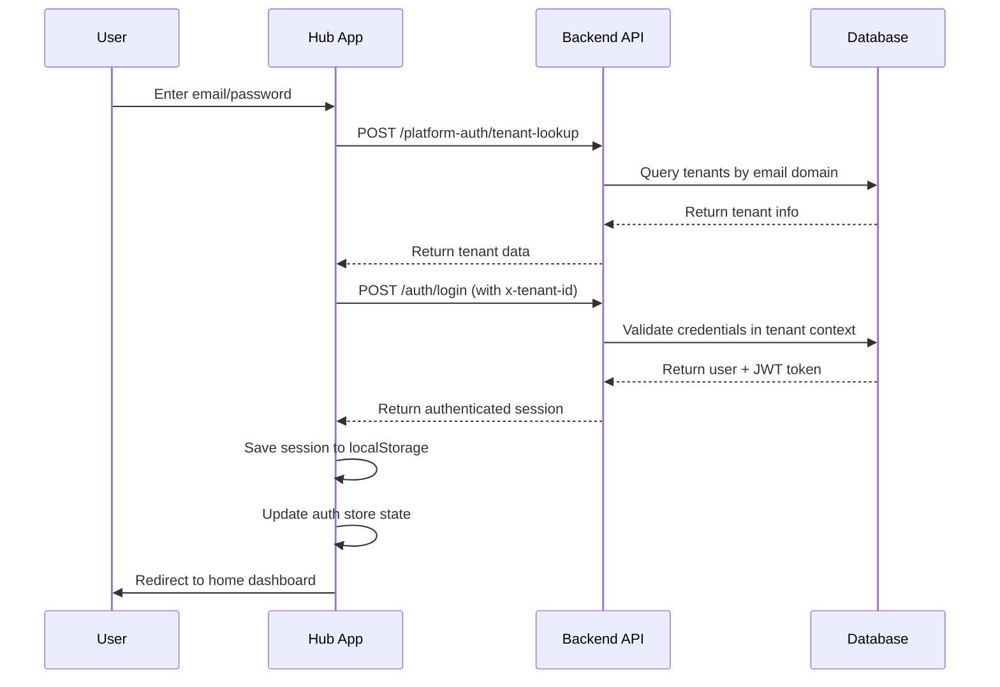
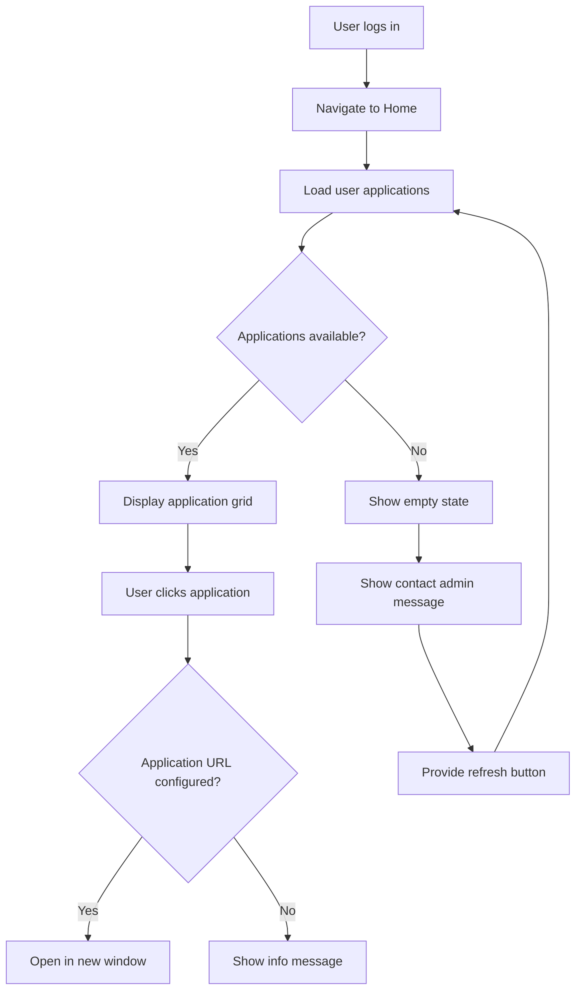

# Hub Application Audit Report

## Executive Summary

**Application:** Hub - Self-Service Application Portal
**Scope:** Platform-scoped self-service portal for end users
**Architecture:** Single-page application with minimal routing
**Primary Function:** Display and access user's authorized applications

### Key Metrics
- **UI Components:** 7 core components
- **API Endpoints:** 1 primary endpoint (`/me/apps`)
- **Routes:** 2 main routes (`/`, `/login`)
- **Authentication:** JWT with tenant-scoped headers
- **External Dependencies:** Minimal (React Router, Zustand, Framer Motion)

### Architecture Overview
The Hub application serves as a self-service portal where authenticated users can view and access their authorized applications. It features a simplified architecture focusing on authentication and application discovery, without complex business logic or data management.

---

## API Integration Analysis

### Endpoint Mapping Table

| Route | Method | Frontend Service | UI Component | Purpose | Status |
|-------|--------|------------------|--------------|---------|--------|
| `/internal/api/v1/me/apps` | GET | `hubService.getMyApps()` | `Home.tsx` | List user's accessible applications | ✅ Active |
| `/internal/api/v1/auth/login` | POST | `hubService.login()` | `Login.tsx` | User authentication | ✅ Active |
| `/internal/api/v1/auth/me` | GET | `hubService.getUserProfile()` | Not used | Get user profile | ⚠️ Unused |
| `/internal/api/v1/auth/refresh` | POST | `hubService.refreshToken()` | Not used | Token refresh | ⚠️ Unused |
| `/internal/api/v1/auth/logout` | POST | `hubService.logout()` | `Header.tsx` | User logout | ✅ Active |

### API Route Details

#### Primary Endpoint: `/internal/api/v1/me/apps`
- **File:** `src/server/api/internal/routes/me.js:31`
- **Authentication:** Bearer token required
- **Tenant Context:** Required via `x-tenant-id` header
- **Query Logic:** Joins `user_application_access`, `applications`, and `tenant_applications`
- **Filters:** Active licenses, non-expired access, user permissions
- **Response:** Array of user's accessible applications with metadata

```sql
-- Core query for user applications
SELECT a.id, a.slug, a.name,
       uaa.role_in_app AS "roleInApp",
       uaa.expires_at AS "expiresAt",
       ta.status AS "licenseStatus"
  FROM public.user_application_access uaa
  JOIN public.applications a ON a.id = uaa.application_id_fk
  JOIN public.tenant_applications ta ON ta.application_id_fk = uaa.application_id_fk
 WHERE uaa.tenant_id_fk = $1 AND uaa.user_id_fk = $2
   AND uaa.active = true AND ta.active = true
   AND (uaa.expires_at IS NULL OR uaa.expires_at > NOW())
```

---

## Frontend Architecture

### Component Structure

```
src/client/apps/hub/
├── main.tsx              # Application entry point
├── routes.tsx             # Route configuration
├── pages/
│   ├── Home.tsx          # Main dashboard
│   └── Login.tsx         # Authentication page
├── components/
│   ├── Layout.tsx        # App layout wrapper
│   ├── Header.tsx        # Navigation header
│   └── Sidebar.tsx       # Navigation sidebar
├── services/
│   └── hub.ts            # API service layer
└── store/
    ├── auth.ts           # Authentication state
    └── ui.ts             # UI state management
```

### State Management

#### Authentication Store (`auth.ts`)
- **Library:** Zustand with persistence
- **Storage Key:** `hub-auth-storage`
- **State Shape:**
  ```typescript
  interface AuthState {
    isAuthenticated: boolean
    user: User | null
    token: string | null
    tenantId: number | null
    isLoading: boolean
    error: AppError | null
    isHydrated: boolean
  }
  ```

#### UI Store (`ui.ts`)
- **Library:** Zustand (simple state)
- **Purpose:** Sidebar visibility control
- **State Shape:**
  ```typescript
  interface UIState {
    sidebarOpen: boolean
    toggleSidebar: () => void
    setSidebarOpen: (open: boolean) => void
  }
  ```

### User Interface Components

#### 1. Login Page (`pages/Login.tsx`)
- **Purpose:** User authentication interface
- **Features:**
  - Two-step authentication (tenant lookup + login)
  - Form validation (client + server)
  - Password visibility toggle
  - Error handling with banner/field-level errors
  - Automatic redirect after authentication
- **Key Functions:**
  - `validateForm()` - Client-side validation
  - `handleSubmit()` - Authentication flow
  - Integration with `useAuthStore` for state management

#### 2. Home Dashboard (`pages/Home.tsx`)
- **Purpose:** Main application portal interface
- **Features:**
  - Grid layout for application cards
  - Loading states with skeleton animations
  - Empty state handling
  - Application launching via `window.open()`
  - Refresh capability
- **Key Functions:**
  - `loadUserApps()` - Fetch user's applications
  - `handleAppClick()` - Launch application in new window
  - `getAppIcon()` - Application icon rendering

#### 3. Layout Components
- **Layout.tsx:** Main app wrapper with header, sidebar, and outlet
- **Header.tsx:** Uses common header component with Hub-specific config
- **Sidebar.tsx:** Minimal navigation (only "Home" link)

### Route Protection

#### Protected Routes
- Uses `ProtectedRoute` wrapper component
- Checks `isAuthenticated` and `isHydrated` state
- Redirects to `/login` if unauthenticated
- Shows loading spinner during state hydration

#### Public Routes
- Uses `PublicRoute` wrapper component
- Redirects authenticated users to `/` (home)
- Only allows access to `/login` for unauthenticated users

---

## Authentication Flow

### Login Process (Two-Step Authentication)



### Session Management
- **Storage:** Browser localStorage via Zustand persistence
- **Key:** `hub-auth-storage`
- **Data:** User profile, JWT token, tenant ID
- **Restoration:** Automatic on app initialization
- **Cleanup:** On logout or session expiry

---

## User Experience Flow

### Application Discovery Flow



### Key User Interactions

1. **Login Process**
   - Enter email/password
   - System looks up tenant automatically
   - Authentication with tenant context
   - Automatic redirect to dashboard

2. **Application Access**
   - View grid of available applications
   - Click to launch in new window/tab
   - Fallback for unconfigured URLs

3. **Error States**
   - Network errors with retry options
   - Empty states with clear messaging
   - Authentication errors with field-level feedback

---

## Database Schema Integration

### Core Tables Used

#### user_application_access
```sql
CREATE TABLE user_application_access (
  id SERIAL PRIMARY KEY,
  user_id_fk INTEGER NOT NULL REFERENCES users(id),
  tenant_id_fk INTEGER NOT NULL REFERENCES tenants(id),
  application_id_fk INTEGER NOT NULL REFERENCES applications(id),
  role_in_app VARCHAR(50),
  active BOOLEAN DEFAULT true,
  expires_at TIMESTAMP,
  created_at TIMESTAMP DEFAULT CURRENT_TIMESTAMP
);
```

#### applications
```sql
CREATE TABLE applications (
  id SERIAL PRIMARY KEY,
  slug VARCHAR(100) UNIQUE NOT NULL,
  name VARCHAR(255) NOT NULL,
  description TEXT,
  url VARCHAR(500),
  icon_url VARCHAR(500),
  active BOOLEAN DEFAULT true
);
```

#### tenant_applications
```sql
CREATE TABLE tenant_applications (
  id SERIAL PRIMARY KEY,
  tenant_id_fk INTEGER NOT NULL REFERENCES tenants(id),
  application_id_fk INTEGER NOT NULL REFERENCES applications(id),
  status VARCHAR(50) DEFAULT 'active',
  active BOOLEAN DEFAULT true
);
```

---

## Security Implementation

### Authentication Security
- **JWT Tokens:** Bearer token authentication
- **Tenant Isolation:** All requests include `x-tenant-id` header
- **Session Storage:** Encrypted localStorage persistence
- **Route Protection:** Client-side route guards

### Data Access Controls
- **User Scope:** Only returns applications user has access to
- **Tenant Scope:** Filters by user's tenant context
- **License Validation:** Checks active licenses and expiry dates
- **Role-Based Access:** Includes user's role within each application

### Security Headers
- **CORS:** Configured for specific origins
- **Content Security Policy:** Implemented via common security middleware
- **XSS Protection:** Input sanitization and output encoding

---

## Performance Considerations

### Frontend Performance
- **Code Splitting:** Single-page app with minimal bundle size
- **State Management:** Efficient Zustand stores with selective re-renders
- **Animation:** Framer Motion for smooth UI transitions
- **Loading States:** Skeleton screens for perceived performance

### API Performance
- **Query Optimization:** Single query with JOINs for app listing
- **Caching Strategy:** Client-side state caching via Zustand
- **Error Handling:** Graceful degradation with retry mechanisms

### Bundle Analysis
- **Dependencies:** Minimal external dependencies
- **Tree Shaking:** Optimized builds via Vite
- **Asset Optimization:** Icon caching and lazy loading

---

## Error Handling

### Frontend Error Patterns
- **Network Errors:** Retry mechanisms with user feedback
- **Authentication Errors:** Clear field-level and banner messages
- **Validation Errors:** Real-time client-side validation
- **API Errors:** Centralized error handling via feedback system

### Backend Error Responses
- **Standard Format:** Consistent error response structure
- **Status Codes:** Appropriate HTTP status codes
- **Error Codes:** Machine-readable error identifiers
- **User Messages:** Human-readable error descriptions

---

## Development Guidelines

### Code Standards
- **TypeScript:** Strict typing for all frontend code
- **ESLint:** Consistent code formatting and linting
- **Component Structure:** Functional components with hooks
- **State Management:** Zustand for lightweight state management

### Testing Strategy
- **Unit Tests:** Component and service layer testing
- **Integration Tests:** API endpoint testing
- **E2E Tests:** Critical user flow testing
- **Performance Tests:** Load testing for API endpoints

### Deployment Considerations
- **Environment Variables:** Configuration via environment files
- **Build Process:** Vite build optimization
- **Static Assets:** CDN deployment for optimal performance
- **Health Checks:** Application health monitoring

---

## Future Enhancement Opportunities

### User Experience
- **Application Categories:** Group applications by category/type
- **Search Functionality:** Search and filter applications
- **Recent Applications:** Track and display recently accessed apps
- **Application Details:** Expanded application information and screenshots

### Administrative Features
- **Usage Analytics:** Track application usage patterns
- **Access Logs:** Audit trail for application access
- **Bulk Operations:** Mass application management
- **Custom Dashboards:** Personalized user dashboards

### Technical Improvements
- **Progressive Web App:** PWA capabilities for mobile use
- **Offline Support:** Cached application data for offline access
- **Real-time Updates:** WebSocket integration for live updates
- **API Versioning:** Structured API evolution strategy

---

*This audit document provides a comprehensive overview of the Hub application architecture, implementation, and operational characteristics as of the current system state.*