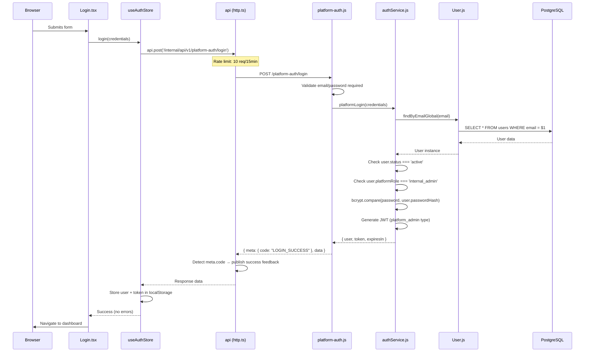

# Internal Login Audit - Simplia PaaS

**Data da Auditoria:** 18 de setembro de 2025
**Investigador:** Claude Code
**Escopo:** Fluxo de Login da Internal Admin UI

## 1) Visão Geral do Fluxo

O Internal Admin usa exclusivamente **Platform Login** (Global scope) sem contexto de tenant. O fluxo é:

```
1. Usuário acessa tela de Login (/auth/login)
2. Insere email/password
3. Frontend chama POST /internal/api/v1/platform-auth/login (SEM x-tenant-id)
4. Backend valida credenciais + verifica platform_role = 'internal_admin'
5. Gera JWT com payload específico de platform admin
6. Frontend armazena token e redireciona para dashboard
```

**Diferencial Crítico:** O login do Internal Admin **NÃO** usa tenant context, é exclusivo para equipe Simplia com `platform_role = 'internal_admin'`.

## 2) Endpoints Chamados pela Tela

### Endpoint Principal: Platform Login

| Campo | Valor |
|-------|-------|
| **Método** | `POST` |
| **URL** | `/internal/api/v1/platform-auth/login` |
| **Headers** | `Content-Type: application/json`<br>`Authorization: Bearer <token>` (não necessário) |
| **Body** | `{ "email": "string", "password": "string" }` |
| **Rate Limit** | 10 requests / 15 minutos |

### Request Example
```json
{
  "email": "consultoriasimplia@gmail.com",
  "password": "securePassword123"
}
```

### Response Success (200)
```json
{
  "meta": {
    "code": "LOGIN_SUCCESS",
    "message": "Signed in successfully."
  },
  "data": {
    "user": {
      "userId": 1,
      "email": "consultoriasimplia@gmail.com",
      "firstName": "Simplia",
      "lastName": "Admin",
      "name": "Simplia Admin",
      "platformRole": "internal_admin",
      "active": true,
      "createdAt": "2025-01-01T00:00:00.000Z"
    },
    "token": "eyJhbGciOiJIUzI1NiIsInR5cCI6IkpXVCJ9...",
    "expiresIn": "24h"
  }
}
```

### Endpoints NÃO Utilizados no Fluxo de Login

| Endpoint | Uso Real | Por que não está no login |
|----------|----------|---------------------------|
| `/platform-auth/me` | Verificar perfil após login | Não necessário durante login |
| `/platform-auth/refresh` | Renovar token expirado | Usado apenas quando token expira |
| `/platform-auth/logout` | Logout explícito | Usado apenas no logout |
| `/auth/login` | Login tenant-scoped | Internal Admin é platform-scoped |

## 3) Backend: Validações Aplicadas

### Rota: `/platform-auth/login` (platform-auth.js:70)

#### Validações em Ordem:
1. **Validação de Entrada** (linha 75-80)
   - Email obrigatório
   - Password obrigatório

2. **Chamada de Serviço** (linha 82-85)
   - `authService.platformLogin(credentials)`

3. **Validações no AuthService** (authService.js:154)
   - **Busca Global**: `User.findByEmailGlobal()` - sem tenant context
   - **Status Check**: `user.status === 'active'` (linha 173)
   - **Platform Role**: `user.platformRole === 'internal_admin'` (linha 178)
   - **Password bcrypt**: `bcrypt.compare()` (linha 183)

4. **Rate Limiting**
   - 10 requests por 15 minutos por IP
   - Middleware: `createRateLimit(15 * 60 * 1000, 10)`

### Validações Críticas
```javascript
// 1. Usuario ativo
if (user.status !== 'active') {
  throw new Error('Account is inactive or suspended');
}

// 2. Platform role obrigatório
if (!user.platformRole || user.platformRole !== 'internal_admin') {
  throw new Error('Insufficient platform privileges - internal_admin role required');
}

// 3. Password com bcrypt
const isPasswordValid = await this.comparePassword(password, user.passwordHash);
if (!isPasswordValid) {
  throw new InvalidCredentialsError();
}
```

## 4) Consultas/Alterações no BD

### Tabelas Consultadas

| Tabela | Query | Colunas Acessadas |
|--------|-------|-------------------|
| `public.users` | `SELECT * FROM public.users WHERE email = $1 AND status != 'deleted'` | `id`, `email`, `password_hash`, `first_name`, `last_name`, `status`, `platform_role`, `created_at` |

### Queries Executadas (User.js)

#### 1. Busca por Email Global (linha 76)
```sql
SELECT * FROM public.users
WHERE email = $1 AND status != 'deleted'
```

**Parâmetros:** `[email]`
**Propósito:** Localizar usuário sem contexto de tenant

#### 2. Campos Críticos Verificados
- `password_hash` → Validação bcrypt
- `status` → Deve ser 'active'
- `platform_role` → Deve ser 'internal_admin'

### Alterações no BD
**NENHUMA** - O login é read-only, não atualiza `last_login` nem cria logs de auditoria.

## 5) JWT: Payload Emitido

### Estrutura do JWT Token (authService.js:189)
```json
{
  "userId": 1,
  "email": "consultoriasimplia@gmail.com",
  "name": "Simplia Admin",
  "platformRole": "internal_admin",
  "iat": 1726678800,
  "type": "platform_admin",
  "exp": 1726765200,
  "iss": "simplia-paas"
}
```

### Características do Platform JWT
- **Sem tenant context**: Não contém `tenantId`, `schema`, `allowedApps`
- **Campo `type`**: `"platform_admin"` para diferenciação
- **Expiração**: 24h (configurável via `JWT_EXPIRES_IN`)
- **Issuer**: `"simplia-paas"`

## 6) Diferenças entre Platform Login vs Tenant Login

| Aspecto | Platform Login (`/platform-auth/login`) | Tenant Login (`/auth/login`) |
|---------|------------------------------------------|------------------------------|
| **Headers** | Nenhum header especial | `x-tenant-id` obrigatório |
| **Middleware** | Rate limit apenas | Rate limit + tenant middleware |
| **Validação** | `platform_role = 'internal_admin'` | Usuário do tenant específico |
| **Busca DB** | `findByEmailGlobal()` | `findByEmail(email, tenantId)` |
| **JWT Payload** | `type: platform_admin`, sem tenant | `tenantId`, `allowedApps`, `userType` |
| **Uso** | Equipe Simplia (global) | Usuários finais (tenant-scoped) |

## 7) Erros & Códigos

### HTTP Status Codes

| Status | Condição | Mensagem |
|--------|----------|----------|
| **400** | Email/password ausentes | "Email and password are required" |
| **401** | Credenciais inválidas | "Invalid email or password" |
| **403** | Sem platform_role | "Insufficient platform privileges" |
| **403** | Conta inativa | "Account is inactive or suspended" |
| **429** | Rate limit excedido | Rate limiting response |
| **500** | Erro interno | "Platform login failed" |

### AppError/AppFeedback Integration

#### Sucesso (via meta envelope)
```json
{
  "meta": {
    "code": "LOGIN_SUCCESS",
    "message": "Signed in successfully."
  }
}
```
- Interceptor HTTP detecta `meta.code` automaticamente
- Publica toast de sucesso via AppFeedback system

#### Erro (mapeamento AppError)
```javascript
// HTTP Client mapeia 401 → AppError kind 'auth'
// Catálogo converte para: "Incorrect email or password"
```

### Tratamento de Erros no Frontend
- **Banner Error**: Erros de autenticação (`shouldShowAsBanner`)
- **Field Errors**: Validação de campos (`shouldShowFieldErrors`)
- **Auto-logout**: Token expirado → clear storage + redirect

## 8) Itens Suspeitos: Endpoints Não Usados pela Tela

### Descobertas da Investigação

#### ⚠️ Inconsistência: api.auth.login()
**Arquivo:** `internal-admin/services/auth.ts:28`
```typescript
const response = await api.auth.login(credentials)  // UNDEFINED!
```

**Problema:** `api.auth.login()` não existe no HttpClient. O store usa diretamente:
```typescript
// auth store (linha 54) - CORRETO
const response = await api.post('/internal/api/v1/platform-auth/login', credentials)
```

**Status:** Código morto - `authService.login()` nunca é chamado pela tela.

#### ✅ Endpoints Válidos Não Usados no Login

| Endpoint | Uso Legítimo | Quando Seria Chamado |
|----------|--------------|----------------------|
| `/platform-auth/me` | Verificar perfil do admin | Após login, em outras telas |
| `/platform-auth/refresh` | Renovar token | Background, quando expira |
| `/platform-auth/logout` | Logout seguro | Botão logout |

## 9) Diagrama de Sequência



## Resumo Executivo

✅ **Fluxo Funcional**: O login do Internal Admin está completamente implementado e funcional.

✅ **Segurança Adequada**: bcrypt, JWT, rate limiting, validação de platform_role.

✅ **Diferenciação Clara**: Platform login vs Tenant login bem segregados.

⚠️ **Código Morto**: `authService.login()` não é usado, apenas `api.post()` direto.

✅ **Error Handling**: AppError/AppFeedback system integrado corretamente.

✅ **Rate Limiting**: 10 requests/15min protege contra brute force.

**Recomendação:** Remover `api.auth.login()` não utilizado do `services/auth.ts` para limpeza de código.